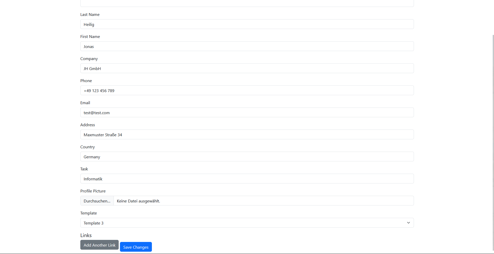
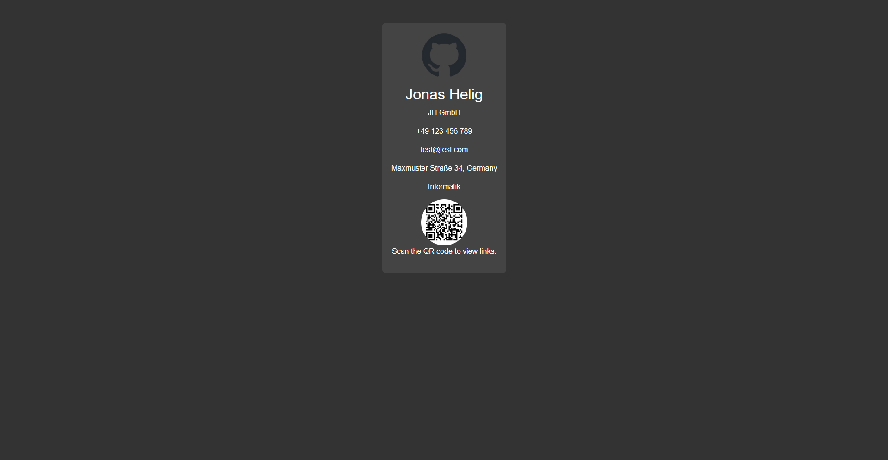
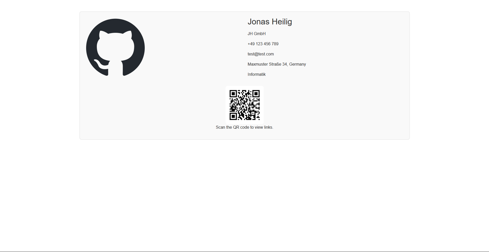
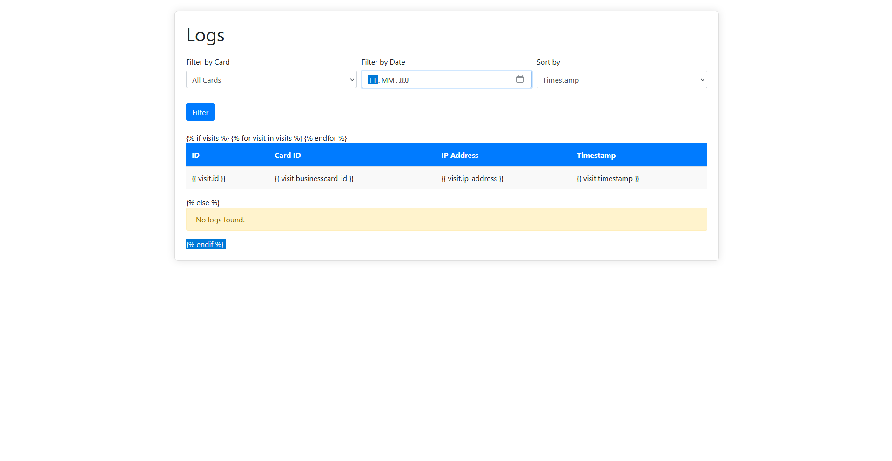

# DigitalBusinessCard System
## Description
This is a simple system to create and manage digital business cards for your copmany or personal use.

## Installation
1. Clone the repository
2. Install Requirements (`pip install -r requirements.txt`)
3. Run Program (`python app.py`)
4. Change Password and supersecret key in app.py

## Routes
- `/` - Home Page → See all business cards
- `/card/<int:id>` - View a business card with the selected View
- `/links/<int:id>` - View the links of a business card
- `/create` - Create a new business card
- `/edit/<int:id>` - Edit a business card
- `/logs>` - View the access logs and filter by date and card 

## Preview
Main Page  
  

Create Card  
  

Edit Card  
  

View Card (Template 1) 
  

View Card (Template 2) 
  

View Card (Template 3) 
  

Show Links 
  

Logs 
  
I make a picture of the template html for private reasons  